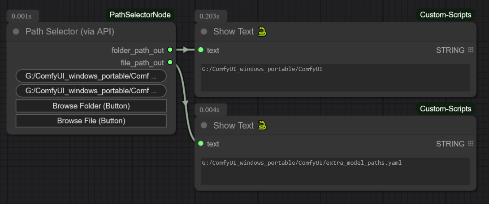
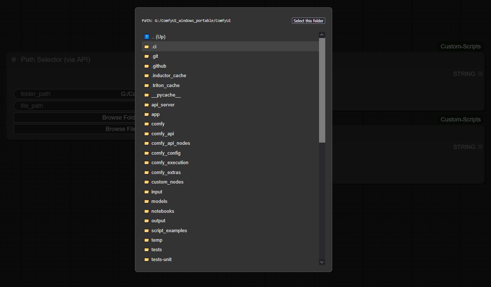
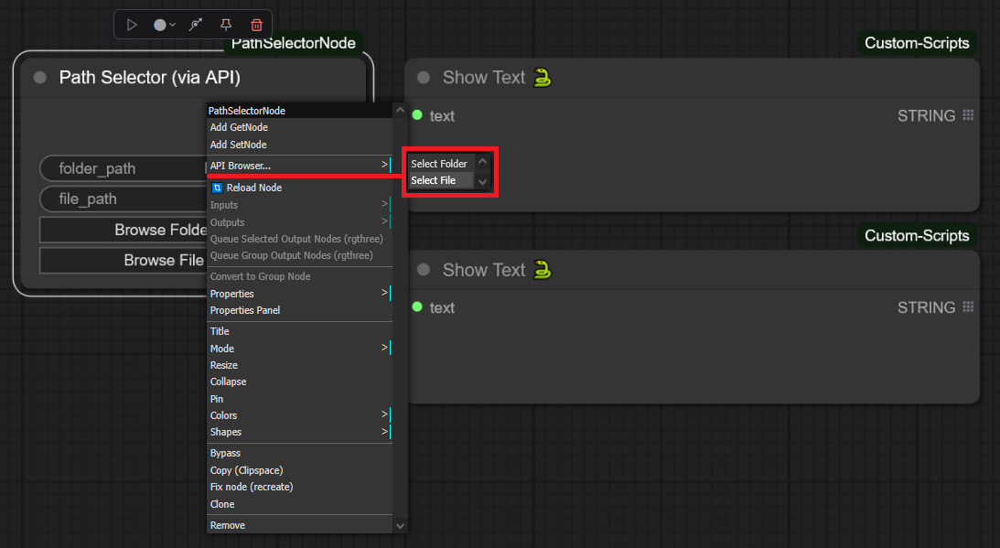
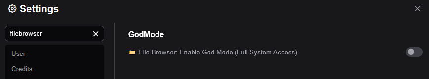

 # ComfyUI File Browser API

A general-purpose, dependency-free File and Folder Browser API for ComfyUI custom nodes.

This extension provides a backend service and a frontend JavaScript class (`app.FileFolderAPI`) that allows any custom node to easily add file and folder browsing capabilities, triggered by any UI event.

This is a simple example node that integrates API functionality using several widgets and other events, such as 2 button widgets, a double-click event on the node, and a menu that adds both the file and folder picker.

*(Note: If you want to try the features/uses described here, just copy "PathSelectorExample" into your "...\ComfyUI\custom_nodes" folder).*



This is what the selector actually looks like




## 🚀 Instalación

1.  Navigate to your `ComfyUI/custom_nodes/` directory.
2.  Clone this repository:
    ```bash
    git clone https://github.com/GalactusX31/ComfyUI-FileBrowserAPI
    ```
    *(Note: The folder name can be anything, but starting it with `0_` or `AAA_` is recommended to ensure it loads before other nodes that depend on it).*
3.  Restart ComfyUI.

## ✨ Features

*   **Dependency-Free:** Requires no `pip install`. Works out-of-the-box with any ComfyUI installation.
*   **Server-Side Browser:** Allows users to browse the file system of the machine running the ComfyUI server, which is essential for workflows.
*   **Dual Mode:** Supports both `'file'` and `'folder'` selection modes.
*   **Dual Security Mode:** An option has been added to Comfyui settings to switch between "Secure Mode | Full Access". This option allow you to restrict browsing between ONLY the ComfyUI root and full access to the rest of the machine's disks.  Safe Browsing is enabled by default.
*   **Flexible Integration:** The API can be triggered from any UI element or event.

## 🛠️ How to Use (For Node Developers)

This package is a **library**. It does not add any visible nodes on its own. Its purpose is to be used by other custom nodes.

To add a file or folder browser to your own node, ensure this API package is installed and use one of the following integration patterns in your node's **JavaScript file**.

### Integration Patterns

Here are several ways to trigger the File Browser API, from a standard button to more advanced UI events.

1. Adding a Standard Button
2. Triggering on Node Double-Click
3. Adding to the Right-Click Menu
4. Any other event.
   
### Example: Adding a Right-Click Submenu



### Configuration that allows full access



## License

This project is licensed under the MIT License. See the `LICENSE` file for details.
